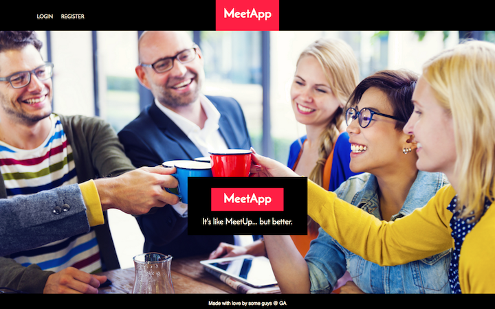
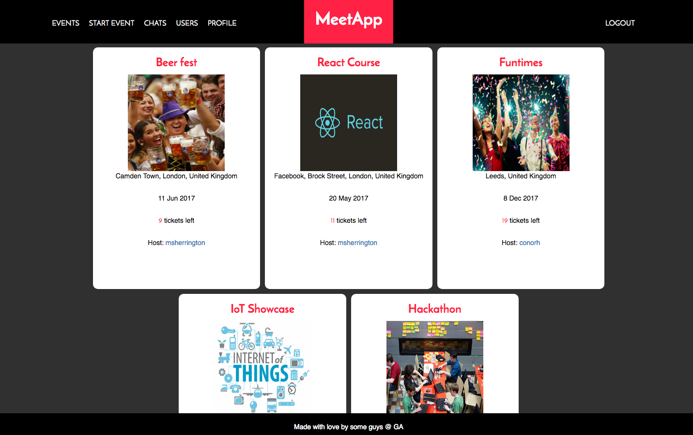
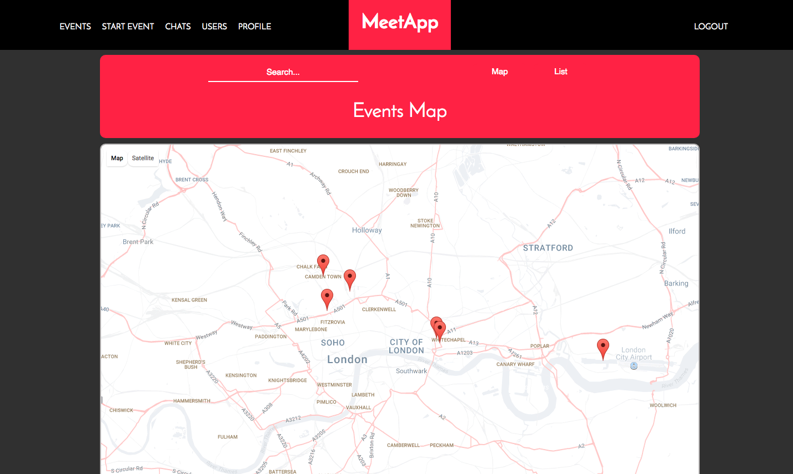
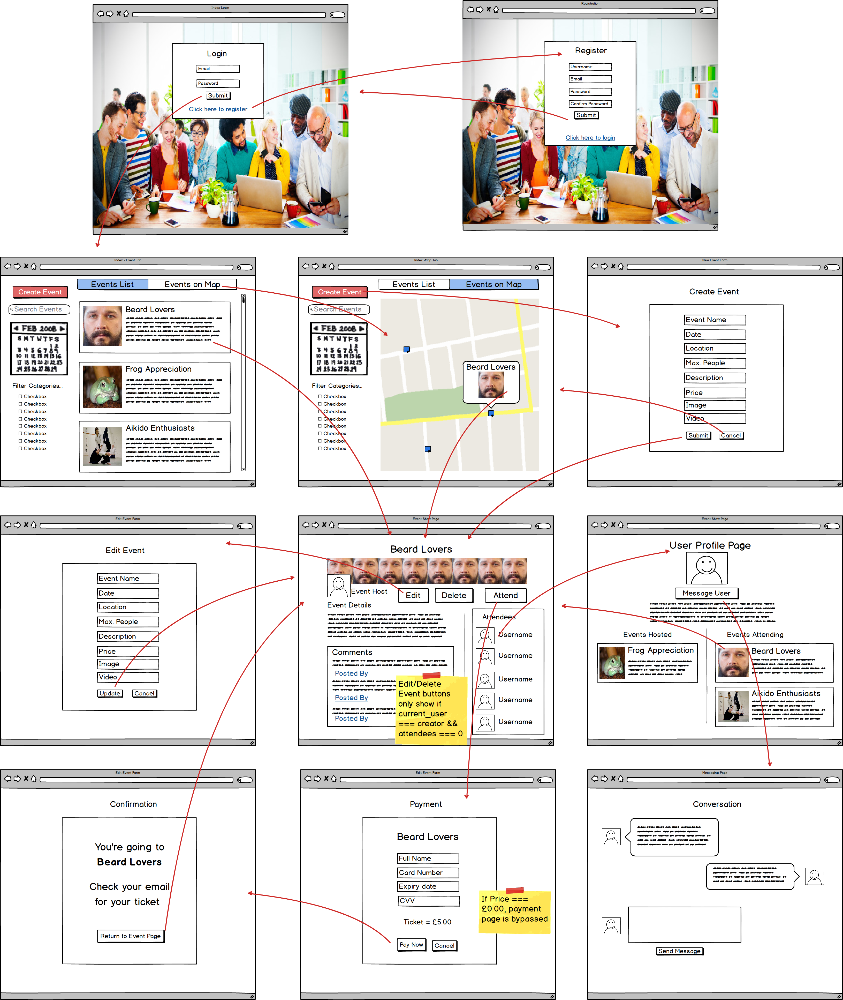
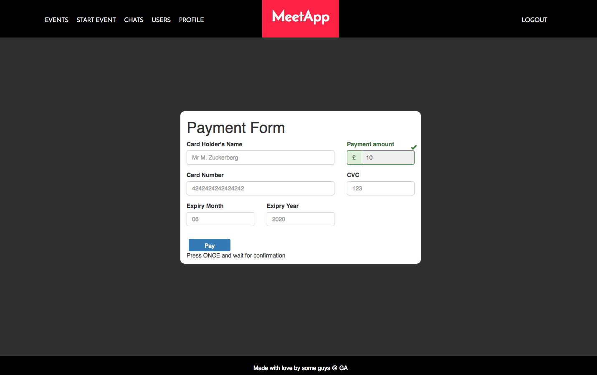
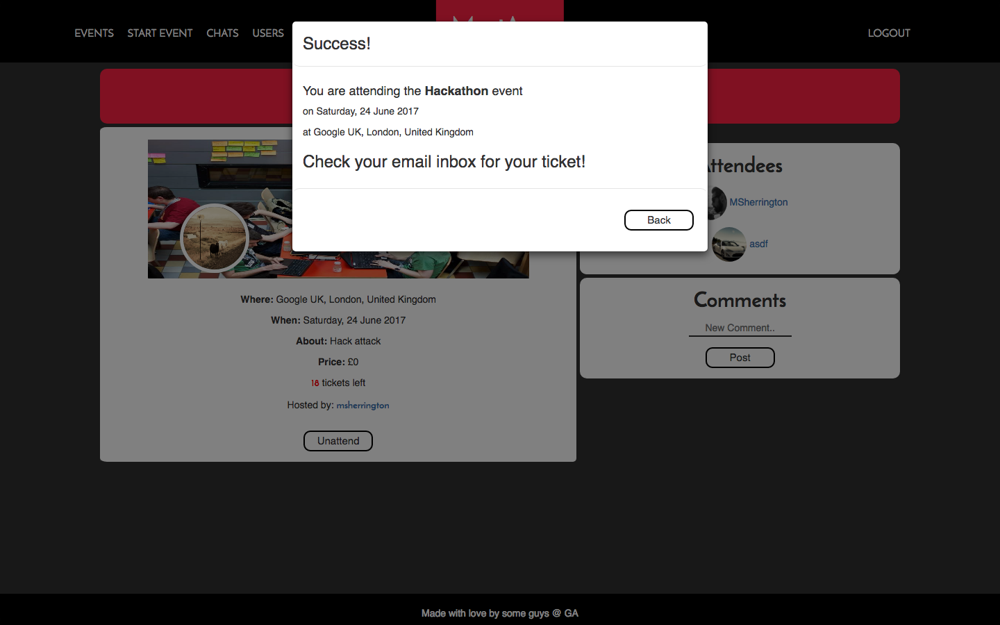

## GA WDI 25 London - Project 4

# MeetApp

The final project of the Web Development Immersive course was a team project with two other students. We decided early on that we all wanted the challenge of recreating an existing website, using the full breadth of our learning from the 3 month course. We were all inspired by the idea of a social networking site, and decided that a meet-up style events platform would provide a large enough scope to be challenging and enjoyable.

#### The result is... MeetApp ([click to use app](https://meet-app-events.herokuapp.com/))

### User Interaction

MeetApp provides a platform for users to find attend events organised by other users. Once logged in, users can view local events on a map, or see a full list of all upcoming events. They can view the event details and a list of other users attending, then choose to attend if they want. Charged events can be paid for through the site. Once attendance is confirmed, a ticket will be emailed to the user's provided email address. Users can also set-up their own events, or message other site users through MeetApp's internal messaging system.

***

### Wire Framing

We stuck closely to the original wire frame planning.

***

### How it works:

* Users can register in the usual way and will receive a welcome email in their inbox.
* Alternatively users can login using GitHub or Facebook OAuth.
* Logged-in users can view events on an embedded Google Map or in an indexed list.
* ng-filter is employed so events can be searched for more specifically.
* Users can view event details and other attendees
* When users choose to attend an event, they are directed to a payment page, or straight to ticketing for free events.
* Once a user is attending an event, they will receive their ticket by email.
* Users can create and host their own events.
* A user profile page shows separately any events the user is hosting, or attending.
* Logged-in users can view a list of all other site users.
* Users can message each other through the internal messaging system.

#### The build:

* HTML 5, CSS, SCSS and Angular were used to create views.
* The database is a Ruby on Rails API.
* Ruby ActionMailer is used to email users.
* Stripe API is used for accepting card payments.
* AWS S3 for image upload.
* Angular directive for base64 image encoding and decoding.
* Angular directive for Google Maps API, Google Location Autocomplete.
* JWT for Facebook and GitHub authenticated login.

## Problems & Challenges:

When we first started the project, we each took one fundamental aspect of the project to start building. I was primarily responsible for building the Ruby on Rails API. Having little experience of doing this with so many models, I found it challenging to ensure that the models and tables had the correct relationships. A few rollbacks were needed, but eventually I got the API working correctly.

After this we broke down the remaining work and put all of our tasks into Trello, then worked on a ticketing basis, each working on something as needed. This was very effective and we only came across a couple of issues.

One issue was how to avoid sending a user to Stripe API if the event is free. Two of us pair-coded a neat function to direct user flow based on the price of the event. Paid events go through Stripe, and only create a ticket if payment is successful, whereas users are directed straight to ticketing for free events.

We had a challenge of users still being able to attend an event a receive a ticket, even if the event was already sold-out. Despite creating a tickets model, and creating a tickets_left attribute on the Event model, we had difficulty making this work effectively and eventually found a useful article on StackOverflow for setting up a method in the Event Serializer.

The only other issue we encountered was having too large a scope, and having to leave a few tasks on the To-Do list for completing in the future. As a group we prioritised tasks daily and included everything we thought necessary before the project deadline.

### Future Improvements

I would like to make the following improvements to this app...

- Implement Google OAuth login.
- Use Web Sockets to allow push notifications on the internal messaging system.
- Style the email messages and add a logo.
- Add a QR code to the ticketing emails.
- Set-up an easier route to refund paid tickets if necessary.
- Improve the overall responsiveness.
